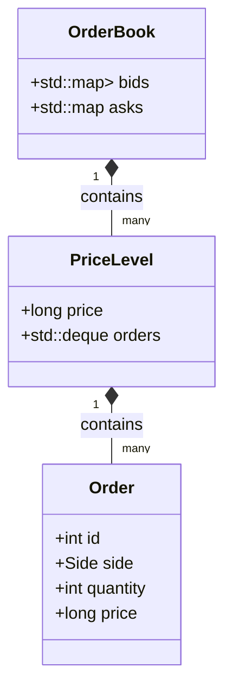

# Mini Electronic Exchange: 3-Day Sprint Handbook

## Executive Summary

This handbook guides the design and implementation of a **mini electronic exchange**, covering 15 features (modules) plus a TCP networking interface over an intensive three-day sprint.  Each module couples a key market microstructure concept with C++ system design.  By following this guide, you will build a simplified limit-order market: defining orders, maintaining an order book (buy/sell depth), executing trades under price-time priority, and producing common market outputs (spread, VWAP, depth, trade tape, etc.).  You will learn core C++ topics (OOP, STL containers like `std::map`, I/O, threads/sockets, CMake) while internalizing finance concepts (limit/market orders, bid-ask spread, volume-weighted price, advanced order types).  At the end of 3 days you will have a working match engine with logging and test clients, plus thorough documentation of design decisions and theory.  

This sprint is organized into modules, each with **finance objectives** and **coding objectives**.  We present a comparison table of all modules and then describe each in turn.  For brevity, Modules 2–15 (and the TCP server) are summarized, while **Module 1 (Order Entry)** is documented in exhaustive detail (with step-by-step coding tasks, file contents, tests, outputs, and debugging tips).  An annotated 3-day schedule with hourly milestones and suggested Git commit messages is provided at the end. 

Throughout the text we cite authoritative sources for exchange mechanics (market microstructure papers, exchange docs) and C++ references (cppreference, ISO/standard library documentation) to ensure correctness.  All concepts needed are explained here, so you should encounter no unknown prerequisites beyond what is covered.  

## Module Overview

Below is an overview of all modules.  Each pairs **Finance concepts** (market-side) with **Coding concepts**.  This table and the task list that follows help prioritize work over three days.  (The **Summary** column references detailed sections below. Numbers in brackets e.g.  indicate source citations.)

| Module                 | Finance (Market) Concepts                | C++/Coding Concepts                    |  
|:-----------------------|:-----------------------------------------|:---------------------------------------|
| **1. Order Entry**     | Limit orders (buy/sell at price); tick size; order IDs | Classes, constructors, `enum class`, encapsulation |  
| **2. Order Book**      | Bid/Ask, depth, best price; liquidity   | `std::map` (sorted associative containers); `std::vector` or `std::deque` for FIFO at each price |  
| **3. Matching Engine** | Price-time priority matching; partial fills; trade execution | Algorithms/iterators to traverse book; creating `Trade` objects; currency type |  
| **4. Market Orders**   | Aggressive orders that cross spread immediately | Special handling in matching (price ignored); loops to exhaust book until qty filled or empty |  
| **5. Order Cancellation** | Order lifecycle (open vs cancelled) | Searching by order ID; removing from containers (iterator invalidation issues) |  
| **6. Order Modification** | Revising price/quantity; often implemented as cancel+replace | Safe update: remove then re-add; careful map key changes |  
| **7. Trade History**   | Executed trades report (Time & Sales) | `std::vector<Trade>` or list to log trades; timestamps |  
| **8. Market Statistics** | Bid-Ask Spread; Mid-price; Volume, VWAP, total traded | Calculations: accumulators, double precision arithmetic; printing stats |  
| **9. Time & Sales**    | Trade “tape” (each trade price, size, time) | Console output as trades occur; formatting (timestamp) |  
| **10. Level II Depth** | Market depth: multiple price levels beyond top-of-book | Access `std::map` iterators (begin, rbegin) to list N best levels; formatted output table |  
| **11. IOC / FOK Orders** | IOC: execute available qty, cancel rest; FOK: full fill or cancel | Parameterize orders with time-in-force; conditional matching logic; control flow |  
| **12. Iceberg Orders** | Hidden liquidity: “tip” of iceberg | Track visible vs hidden qty; auto-replenish legs; loop logic to expose more upon fill |  
| **13. Stop Orders**    | Stop (trigger) orders: become market/limit when price reaches stop | Maintain lists of stop orders; monitor last traded price; upon trigger, convert to market/limit and match |  
| **14. Logging**        | Audit trail of all events (orders/trades) – compliance necessity | File I/O (`std::ofstream`); thread-safe logging; timestamp formatting |  
| **15. CSV Export**     | Data export for analysis (trades to CSV) | File I/O; formatting CSV lines; optional quoting |  
| **16. TCP Server**     | Remote order entry interface (simulation of networked exchange) | Sockets (`<sys/socket.h>` or `boost::asio`); threads or async; parsing client input |  

**Prioritized Task List:** For each day, focus on the core matching functionality first, then add features. For example:

- **Day 1:** Setup project (CMake, Git); Module 1 (Order class), Module 2 (OrderBook), Module 3 (Matching Engine core).  
- **Day 2:** Market/Cancel/Modify orders (Modules 4–6); Trade/Stats (7–8); Time & Sales, Level II (9–10).  
- **Day 3:** Advanced orders (IOC/FOK 11, Iceberg 12, Stop 13); Logging and Export (14–15); finally TCP server.  

Below we outline each module.

## Module Details

### Module 1: Order Entry (Limit Orders)  

**Finance concepts:** _Limit buy/sell orders_ (specify price and quantity, executed only at that price or better); tick size (minimum price increment); order ID assignment.  Traders specify a limit order (price–quantity).  This is the basic order type that adds liquidity to the book. 

**Coding concepts:** Define an `Order` class: use an `enum class Side { BUY, SELL }` for clarity.  Use constructors and initializer lists.  Encapsulate fields (e.g. `private int id; double price; int qty; Side side;`).  Practice header/source files, include guards, and CMake target configuration.  Example: `Order(int id, Side side, int qty, double price)`. 

**Theory:** A limit order guarantees price (won’t execute above ask or below bid) but not fill.  Placing a buy limit at price $X means you pay $X or better (lower).  If the market never reaches that price, the order stays open. Conversely, sell limit executes at your price or higher.  This asymmetric certainty (certain price, uncertain fill) makes limits vital for passive liquidity.

**Data structures/algorithm:** Represent each order as an object (e.g. `struct Order`).  Store the orders in the OrderBook (in Module 2) in containers keyed by price.  Here, no complex algorithm is needed yet—just creating orders. 

**Implementation checklist:** 
- Create file `include/Order.hpp` and `src/Order.cpp`.
- In `Order.hpp`, define `enum class Side { BUY, SELL };` and class `Order` with private members (id, side, qty, price).  Add a constructor and `get` methods (const) for each field.
- Implement constructor with initializer list (e.g. `Order::Order(int id, Side side, int qty, double price): id(id), side(side), quantity(qty), price(price) {}`).
- In `main.cpp`, include `"Order.hpp"`.  Write code to create and print a few Orders (e.g. `Order o(1, Side::BUY, 100, 250.0); cout<<o.getSide()<<...`).
- **Commit 1:** “Implement Order class and basic creation”. 
- Confirm compilation (no linker errors) and basic run output. 

**Testing:** Write simple tests (or in `main`) to verify:
  - Order fields are set correctly: create an `Order`, check `getId()`, `getSide()` etc. 
  - Using both BUY and SELL, ensure `enum class` works. 
  - Attempt invalid values (e.g. negative qty) and decide behaviour (at least document that validation happens in next modules).
  
**Expected output:**  
A test run might just construct orders and print:
```
Order 1: BUY 100 @250.00
Order 2: SELL 50 @255.50
```  
or similar, confirming values.

**Interview Questions:**  
- Why use `enum class` for order side instead of `bool` or `int`? (Type safety, readability.)  
- Why encapsulate data fields (private with getters) rather than public? (Information hiding, API stability.)  
- What is a constructor initializer list and why use it?  
- What is the difference between limit and market orders?  

### Module 2: Order Book (Bid/Ask Depth)  

**Finance:** The _order book_ tracks resting limit orders.  Bids (buy orders) and Asks (sell orders) are kept sorted by price.  Best bid is highest buy price; best ask is lowest sell price.  The spread (ask minus bid) is the immediate transaction cost.  Liquidity is shown by how many shares are available at each price.  

**Coding:** Use two associative containers (e.g. `std::map<double, std::vector<Order>> bids, asks;`).  By default `std::map` is sorted ascending by key.  For the ask side, the lowest price is `asks.begin()`.  For bids, the highest price is `--bids.end()` (or use a custom comparator for descending order).  Each map value is a FIFO container (`std::vector` or `std::deque`) of orders at that price (time priority).  

**Theory:** The order book is the core market data structure.  In many exchanges (NYSE, NASDAQ) it follows **price-time priority**: better-priced orders always match first, and at equal price earlier orders fill first.  Thus at each price level, you must preserve arrival order (FIFO).  

**Data structures:** We will implement an `OrderBook` class (e.g. in `OrderBook.hpp/.cpp`) with two maps.  Each map’s key is the price.  Value is a container of pointers or copies of Orders for that price.  Accessing best bid/ask and iterating prices are straightforward with `std::map` iterators.  

**Implementation:**  
- Add files `include/OrderBook.hpp` and `src/OrderBook.cpp`.  
- Define class `OrderBook` with members like `std::map<double,std::vector<Order>> bids, asks;`.  
- Implement `void addOrder(const Order& o)`: insert into `bids` if BUY, or `asks` if SELL, by price.  Push back onto the vector at that price (time priority).   
- Provide methods: `double bestBid()` (return `bids.rbegin()->first` if not empty), `double bestAsk()` (`asks.begin()->first`).  Also maybe `int totalVolumeAtPrice(double price, Side side)`.  
- **Commit 2:** “Implement OrderBook addOrder and bestBid/bestAsk”.  
- Print the top-of-book: after adding sample orders, output “Best bid: …; Best ask: …”. 

**Testing:**  
- Add multiple buy/sell orders at different prices.  Verify that bestBid = highest buy price and bestAsk = lowest sell price.  
- Confirm that multiple orders at same price accumulate in FIFO order: e.g. adding 3 buy orders at $100 should store 3 orders in `bids[100]`.  

**Expected output:**  
```
Added Order 1 (BUY 100@250.00)
Added Order 2 (BUY 50@251.00)
Added Order 3 (SELL 150@255.50)
Best bid: 251.00
Best ask: 255.50
```

**Interview Questions:**  
- Why use `std::map` for the order book? (Sorted keys, log(N) operations, easy best-price retrieval.)  
- What are the complexities of `map.insert`, `map.erase`, and map lookup? (O(log N) worst-case.)  
- Why store multiple orders at one price in a `std::vector` instead of e.g. a single aggregate? (To preserve individual order identity and time priority.)  
- What is the bid-ask spread and why is it important?  

### Module 3: Matching Engine (Trade Execution)  

**Finance:** When a new incoming order can trade against existing orders, the matching engine generates trades.  It applies **price-time priority**: match the best price first; if multiple at that price, fill oldest orders first.  Partial fills are common: an order may execute against several opposing orders until quantity is exhausted.  Any remaining (unfilled) portion of a limit order then rests in the book.  

**Coding:** Implement a `MatchingEngine` (or integrate into `OrderBook::addOrder`) that, when adding an order, checks if it “crosses” the spread: 
- For a buy order, if its price ≥ bestAsk, execute trades with asks starting from lowest ask upward until the buy quantity is filled or no asks below the limit price.  
- For a sell order, if price ≤ bestBid, similarly execute against highest bids downwards.  

Use loops and iterators to consume opposite-book entries in order.  Create a `Trade` struct (with fields like buyOrderId, sellOrderId, qty, price, timestamp) and record each match.

**Theory:** Continuous double auction markets match new orders against the opposite side in real-time.  For example, a buy 100@250 will match the earliest resting sells priced ≤250.  If the first sell has 60 shares, you trade 60@ that sell price (not your 250), leaving 40 to match further or rest.  The trade price is the resting order’s price (reflecting price-time priority).  

**Data structures/algorithm:** Iterate through the map of the opposite side. On each price level, iterate through its order vector. For each resting `Order`, compute `tradeQty = min(incoming.qty, resting.qty)`.  Decrease both orders; if resting order is fully filled (`qty=0`), erase it.  Continue until incoming `qty=0` or no more matches.  If the incoming order has leftover quantity, add it as usual to the book (like Module 2).  

**Implementation:**  
- In `OrderBook::addOrder(Order o)`, implement matching logic first.  Example pseudocode for a buy order with price P:  
  - While `o.qty>0` and `!asks.empty()` and `asks.begin()->first <= P`:  
    • Let `priceLevel = asks.begin()->first`, and get vector of orders at that price.  
    • For each order in that vector: fill as above (generate `Trade`).  
    • If vector empties, erase the price key from `asks`.  
- Define a `Trade` class/struct (in `Trade.hpp`/`Trade.cpp` or inline) with appropriate fields (ids, price, qty, time).  Append trades to a history (vector).  
- **Commit 3:** “Implement matching logic and Trade logging”.  
- After code, test by adding orders that cross: e.g. add sell 100@249 then buy 150@250, expect one trade 100@249, and buy's remainder 50 resting.  

**Testing:**  
- Scenario 1: Add Sell order(s) at 100@248 and buy 150@250.  Confirm a trade: 100 shares at $248 (sell’s price), and 50 shares remain as buy order.  
- Scenario 2: Add multiple opposite orders so partial fills happen over two price levels. Check each trade record.  

**Expected output:**  
```
Trade executed: SellOrder1 vs BuyOrder2, qty=100 @ price=248.00
Unfilled remainder: BUY 50 @250.00 added to book
```
Or in order log form.

**Interview Questions:**  
- What is price-time priority and why is it used? (Explain price-first, then FIFO.)  
- Why do trades execute at the resting order’s price, not the incoming order’s limit? (It preserves economic fairness and predictability.)  
- How do you handle a partially filled order in code? (Adjust quantities, possibly keep in book or remove).  

### Module 4: Market Orders  

**Finance:** A _market order_ is an order to buy/sell immediately at the best available price.  It never rests in the book.  Market buy will consume from lowest asks until done; market sell consumes highest bids.

**Coding:** Represent market orders specially (e.g. price = +∞ for buy, -∞ for sell, or an `isMarket` flag).  In matching logic, treat a market order as “cross all existing best prices”.  I.e., for a market buy, ignore the incoming price check; simply match against asks from the very best upward until quantity=0 or asks empty.  After matching, any unfilled quantity is cancelled (market order does not go into book).

**Implementation:**  
- Extend matching logic: if `o.isMarket` is true, skip the price limit check.  For BUY, loop while `!asks.empty() && qty>0` (all asks).  
- Do not add any leftover market order to the book.   
- **Commit 4:** “Support market orders (immediate execution, no book rest)”.  

**Testing:**  
- Place a market buy order when book has a best ask. Check it trades immediately and does not remain.  
- If book liquidity < order quantity, verify that excess is dropped (no error).  

**Expected output:**  
```
Market BUY 200 -> Trade: 150 @ 249.50; Trade: 50 @ 250.00
Order fully executed (no residual).
```

**Interview Questions:**  
- Why might one use a market order despite paying the spread? (Immediate execution, needs liquidity.)  
- What happens if a market order’s size exceeds all available liquidity? (It will execute as much as possible; remaining size is cancelled.)  

### Module 5: Order Cancellation  

**Finance:** Traders can cancel a resting limit order at any time before it fills or expires.  Cancellation removes the order from the book (and prevents future execution).

**Coding:** Provide a method `cancelOrder(int orderId)`.  We must search for the order in our book.  Approaches: 
- Keep a `std::unordered_map<int, std::pair<Side,double>> index` mapping order ID to its side and price, so we can find it directly. 
- Or do a full scan of both maps (inefficient). Using a lookup map is better. 
- Once located, remove the order from its vector. Erasing in a `std::vector` requires shifting elements (linear time), but cancellations are rarer than adds.  
- If a price level vector becomes empty, erase that key from the map. 

**Implementation:**  
- In `OrderBook`, store a map `orderIndex[id] = (side, price)`.  When adding an order, update this index.  
- Implement `void cancelOrder(int id)`: lookup side and price, then find and erase from `bids[price]` or `asks[price]`.  Remove index entry.  
- **Commit 5:** “Implement order cancel (remove by ID)”.  

**Testing:**  
- Add a few orders and cancel one.  Print book state before/after: ensure the order is gone.  
- Cancel a non-existent ID: decide to ignore or report error (handle gracefully).  

**Expected output:**  
```
Canceling Order 3 (SELL 50@255.00). 
Order 3 removed from book.
Best ask is now 256.00.
```  

**Interview Questions:**  
- How would you efficiently find and remove an order by ID? (Index map or augment data structures.)  
- What happens to the book if you cancel the best bid/ask? (Next best becomes top.)  
- What is iterator invalidation when erasing from a vector? (Pointers/iterators after erased element may be invalid.)  

### Module 6: Order Modification  

**Finance:** Traders sometimes modify a limit order’s price or quantity.  Many exchanges implement “modify” as a cancel-then-replace (since changing price can violate time priority).  

**Coding:** You can allow a `modifyOrder(id, newQty, newPrice)` API. A simple approach: cancel the old order and create a fresh order with same ID (or new ID) and new parameters. If retaining ID, update index map. Else, treat as new order (new ID).  

**Implementation:**  
- Implement `modifyOrder(int id, int newQty, double newPrice)`. Internally do `cancelOrder(id)`, then add new order with same or new ID.  
- **Commit 6:** “Implement order modification via cancel+replace”.  

**Testing:**  
- Place an order, then modify its price upward.  Verify old order gone and new placed (possibly losing time priority).  
- Modify quantity only: either refill back into book or reduce.  

**Expected output:**  
```
Order 5 modified to BUY 150@252.00 (was 100@251.00). 
(Order 5 re-enters as newest at 252.00.) 
```  

**Interview Questions:**  
- Why do exchanges often not allow in-place price change (instead require cancel+reorder)? (To preserve fairness and simplicity.)  
- What edge cases arise (e.g. increasing price above best bid/ask)?  

### Module 7: Trade History (Time & Sales)  

**Finance:** Executed trades are often recorded in a “time and sales” log or tape, showing each trade’s price, quantity, time, and aggressor (bid or ask hit).  This provides transparency of every fill.

**Coding:** Maintain a `std::vector<Trade>` in the matching engine or separate `TradeHistory` class. Each time a match occurs, append a `Trade`.  A `Trade` record should include: buy order ID, sell order ID, execution price, quantity, and timestamp (or sequence counter).   

**Implementation:**  
- Define `struct Trade { int buyId, sellId; int qty; double price; std::chrono::time_point<> time; };`.  
- When matching (Module 3), fill this and push to history.  
- Print each trade as it occurs to console (time can be simulated or real-time).  
- **Commit 7:** “Log trades in TradeHistory; output each trade”.  

**Testing:**  
- Run a match sequence and verify that `TradeHistory` has correct entries.  
- Print the last N trades after some matches.  

**Expected output:**  
```
[10:15:03] Trade: BuyOrder 2, SellOrder 7, qty=40 @250.50
[10:15:03] Trade: BuyOrder 2, SellOrder 8, qty=10 @251.00
```  

**Interview Questions:**  
- What information must a trade record contain? (Price, qty, participant IDs, timestamp.)  
- Why might time and sales be important to traders? (Shows real-time traded prices and sizes; liquidity consumption.)   

### Module 8: Market Statistics (Spread, VWAP, Mid-Price, Volume)  

**Finance:** Exchanges and traders monitor metrics:  
- **Bid-Ask Spread** = (best ask – best bid). Tighter spread = more liquid market.  
- **Mid-Price** = (best bid + best ask)/2, a reference price between buy/sell.  
- **VWAP (Volume-Weighted Avg Price):** the trade-weighted average price over a period, a benchmark for execution quality.  
- **Total volume:** sum of all traded shares.  

**Coding:** Maintain running totals: after each trade, accumulate `totalVolume += qty; totalTurnover += qty * price;`.  VWAP = `totalTurnover / totalVolume`.  Compute spread/mid anytime by querying bestBid/ask.  

**Implementation:**  
- Add variables in engine: `long totalVolume = 0; double totalTurnover = 0.0;`.  Update these on each trade.  
- Implement a function (e.g. `printStats()`) to display: Last trade price, total volume, VWAP, current spread, mid-price.  
- **Commit 8:** “Compute and display market stats (spread, mid, VWAP)”.  

**Testing:**  
- Simulate a few trades and check computed VWAP.  For example, trades: 50@100, 100@102 → VWAP = (50*100+100*102)/(150) = 101.33.  
- Ensure spread logic is correct (if no bids or asks, handle gracefully).  

**Expected output:**  
```
Market Stats: Best Bid=99.50, Best Ask=100.00, Spread=0.50, Mid=99.75
Total Volume=150, VWAP=101.33
```  

**Interview Questions:**  
- How do you compute VWAP and why is it useful? (Shows price paid weighted by volume.)  
- What is mid-price and when might traders use it? (Reference price between bid/ask; e.g. midpoint peg orders.)  

### Module 9: Time & Sales Window  

**Finance:** The time & sales (“the tape”) displays a live feed of executed trades. Traders watch this for pace of trading, order sizes and to gauge momentum.  

**Coding:** Whenever a trade occurs, we have already printed it (Module 7). We can consider this the T&S output. Optionally, provide a function to dump the last N trades in a table (time, price, qty) to mimic a tape.  

**Implementation:**  
- Extend trade printing: include trade time and side (aggressor). Use `std::chrono` to timestamp or an incrementing counter.  
- Provide a `printRecentTrades(int N)` method showing the last N entries in `TradeHistory`.  
- **Commit 9:** “Format time-and-sales output”.  

**Testing:**  
- Execute multiple trades and call `printRecentTrades(5)`. Inspect formatting.  

**Expected output:**  
```
Time      Price   Qty   Side
10:15:02  100.50  20    BUY
10:15:05  101.00  50    SELL
```

**Interview Questions:**  
- What is Time & Sales and why is it important? (Shows every executed trade detail to traders.)  
- How would you store and retrieve recent trades efficiently? (e.g. circular buffer or vector, since write-only append is fast.)  

### Module 10: Level II Market Depth  

**Finance:** *Level II* data shows multiple bid/ask levels and quantities.  Traders use it to see hidden demand/supply. It lists, say, the top 5 price levels with their cumulative size.  

**Coding:** To display depth, iterate through the `asks` and `bids` maps for a few levels.  For example, loop up to N entries from each side:  
- For **Asks**, start at `asks.begin()` (best ask), then `next()`, etc.  
- For **Bids**, start at `--bids.end()` (highest bid), then `prev()`.  

**Implementation:**  
- Implement `printDepth(int levels)` that prints a formatted table: columns “Ask Qty | Ask Price”, then a separator, then “Bid Price | Bid Qty”.  
- Example (if 3 levels):  
  ```
  Ask      |       Bid  
  ----------------------
   120@252.00    250.50@  50  
    80@252.50    250.00@ 100  
    20@253.00    249.50@ 200  
  ```  
- **Commit 10:** “Print market depth (Level II)”.  

**Testing:**  
- Populate book with several prices on each side.  Call `printDepth(5)` and verify it shows sorted levels.  

**Expected output:**  
```
Level II Market Depth:
   ASK       Price    |    Price      BID
 (Qty)              |  (Qty)
   100  @  101.00   |   90  @  100.50
    50  @  101.50   |   60  @  100.00
   --- Spread 0.50 -- (best mid 100.75) 
```

**Interview Questions:**  
- How is the order book data structure used to generate level II displays? (We iterate map levels.)  
- What does a large imbalance in depth suggest about future price movement? (Momentum or support/resistance clues.)  

### Module 11: Immediate-Or-Cancel (IOC) and Fill-Or-Kill (FOK)  

**Finance:** These are time-in-force modifiers. An **IOC** order executes immediately for whatever volume is available and cancels the rest. A **FOK** must be filled completely at once or not at all. (These help traders avoid partial fills when undesired.)  

**Coding:** Extend the order type to include a Time-in-Force enum (`TIF = DAY(default), IOC, FOK`).  On matching:  
- If IOC, allow partial fill (as usual), but do *not* add any unfilled remainder to book; simply drop it after attempting execution.  
- If FOK, first check if full quantity can be matched at current best prices.  E.g. simulate matching without removing from book (peek total available).  If enough volume exists at acceptable prices, execute it fully; otherwise cancel the order entirely (no trade at all).  

**Implementation:**  
- Define `enum class TimeInForce { DAY, IOC, FOK };` in `Order`.  
- In matching logic, if `o.TIF==IOC`, after running as normal, skip the “add remainder” step (implicitly cancel).  
- If `TIF==FOK`, either: (a) fully simulate volume availability first, or (b) after a partial match fails to fill, undo all partial matches and cancel (we can simply abort early if partial occurs). Simpler: Check before matching that either total opposite volume ≥ `o.qty` (only at price ≤ limit) – if not, skip any matching (cancel).  Then proceed normally if possible.  
- **Commit 11:** “Implement IOC and FOK order handling”.  

**Testing:**  
- **IOC:** Place IOC buy for 150 but only 100 available on book; expect a trade of 100 and cancel 50.  
- **FOK:** Place FOK sell for 200 when only 100 exists: expect no trade (cancel all). If 200 is available, expect full execution.  

**Expected output:**  
```
IOC Order: Executed 120 shares; 30 canceled.
FOK Order: Insufficient liquidity; order canceled entirely.
```

**Interview Questions:**  
- What is the difference between IOC and FOK in practice? (IOC allows partial; FOK all-or-nothing.)  
- Why might a trader use FOK? (They require exact quantity for hedging or other reasons, avoiding partial fills.)  

### Module 12: Iceberg Orders (Hidden Quantity)  

**Finance:** An *iceberg order* hides most of its quantity, showing only a small “tip” on the book. After the visible part executes, the next part is automatically sent, and so on.  This helps execute large orders without moving the market too much (reducing market impact).  

**Coding:** Represent iceberg orders by splitting a large order into *legs*. For example, a 1000-share iceberg with tip 100 will only place 100 on book initially.  Each time 100 fills, immediately replace with the next 100, until total done.  Implementation: attach `visibleQty` and `hiddenQty` to an order.  

**Implementation:**  
- Extend `Order` or create a subclass to track iceberg: e.g. `struct IcebergOrder { Order base; int visible, hidden; }`.  
- On add: insert only `visible` into book.  Keep `hidden` aside.  
- On a fill: when an iceberg order’s visible portion is filled and removed, automatically create a new order for the next `visible` part (reduce `hidden` by visible). Continue until hidden is 0.  
- **Commit 12:** “Support Iceberg orders by chunking large orders”.  

**Testing:**  
- Submit an iceberg buy of total 500 (tip 100). Verify the book shows 100@price. Then as 100s execute, new 100s appear until 500 done.  

**Expected output:**  
```
Iceberg Order: 500@250.00 (tip 100). 
Placed 100 visible. 400 hidden remaining.
Trade: 100@250.00 executed; 400 hidden -> 300 left.
New leg: placed 100 visible (300 hidden left).
(continues until complete)
```  

**Interview Questions:**  
- How does an iceberg order work? (Breaks into legs, reveal one at a time.)  
- What are the pros and cons of using an iceberg? (Hides size, reduces impact; but slower execution and complexity.)  

### Module 13: Stop Orders (Stop-Loss / Stop-Market)  

**Finance:** A **stop order** (stop-loss) is a conditional order: it sits idle until the market reaches a trigger price, then becomes a market or limit order.  For example, a sell stop at $95 means “if price drops to 95, sell at market/limit to exit position.”  This is key for risk management (locking in losses or profits).  

**Coding:** Maintain a separate list of stop orders (not in main book) with their trigger price.  Each time a trade occurs (or new order changes best price), check if any stop triggers.  On trigger: convert the stop into a regular order (market or limit) and feed it into matching.  

**Implementation (sketch):**  
- Add to `Order` fields for `bool isStop; double stopPrice; bool stopIsMarket;`.  
- Keep a list (e.g. vector) of active stop orders. Do **not** add stops to the main order book yet.  
- After each trade (or price update), scan stops to see if (for a buy stop) market last traded price ≥ stopPrice, or (for sell stop) ≤ stopPrice.  
- When triggered: remove from stop list, create a new Order (market or limit) as appropriate and process it.  
- **Commit 13:** “Implement basic stop-order triggering”.  

**Testing:**  
- Add a Sell Stop at 95. Simulate trades downwards: when last trade price hits 95, confirm a market sell is executed at ~95.  
- Test stop-limit (trigger then limit).  

**Expected output:**  
```
Sell Stop Order at 95 triggered: converted to market sell.
Executed Sell 50@94.80.
```

**Interview Questions:**  
- What is a stop order and how does it differ from a limit order? (Triggered by price, becomes market/limit.)  
- When might a trader use a stop-loss vs a stop-limit? (Stop-loss guarantees exit but price uncertain; stop-limit guarantees price but may not execute.)  

### Module 14: Logging (Audit Trail)  

**Finance:** Exchanges log every event (order in/out, trade executed) for compliance and analysis.  Audit trails ensure all activity is recorded.  

**Coding:** Use file I/O (`std::ofstream`) to write a log file (e.g. "exchange.log").  Each time an order is placed, cancelled, or executed, append a line (timestamp, event type, details).  Ensure thread safety if concurrent (not needed initially).  

**Implementation:**  
- In `main` or engine, open a log file (`std::ofstream log("exchange.log");`).  
- After each user command/event, write a descriptive entry to log (e.g. “[timestamp] New Order: ID=1 BUY 100@250.00” or “Trade: ID=2↔3 qty=50 price=252.00”).  
- Flush periodically or on every write.  
- **Commit 14:** “Add file logging of all events”.  

**Testing:**  
- Run the engine, then inspect `exchange.log`: it should contain one line per action.  

**Expected content (`exchange.log`):**  
```
2026-06-25 15:10:01 - Order 10: BUY 100@250.00 (limit)
2026-06-25 15:10:02 - Order 11: SELL 50@249.50 (limit)
2026-06-25 15:10:02 - Trade: Order 10 & 11, qty=50 @249.50
2026-06-25 15:10:03 - Order 10: BUY 50@250.00 (remaining)
2026-06-25 15:15:00 - Order 10 cancelled
```

**Interview Questions:**  
- Why is logging important in a trading system? (Audit, debugging, regulatory record.)  
- How would you handle logging in a multi-threaded environment? (Mutex or thread-safe queue to file, etc.)  

### Module 15: CSV Export (Trades/Book Data)  

**Finance:** Exporting data (trades, book snapshots) to CSV allows post-trade analysis in Excel/Python.  This is an essential part of a trading platform’s connectivity.  

**Coding:** Provide a function to write the trade history (or order book) to a CSV file. E.g., “trades.csv” with columns `Time, BuyID, SellID, Price, Qty`. Use `std::ofstream` with `<<` or `std::stringstream`. Escape as needed.  

**Implementation:**  
- After trading session (or on demand), open `trades.csv` and write header plus one line per `Trade` in history.  
- If needed, similarly export current orders (book depth) to another CSV.  
- **Commit 15:** “Write trades to CSV file”.  

**Testing:**  
- After some trades, call `exportTradesCSV()`.  Verify file contains correct CSV.  

**Expected output (`trades.csv`):**  
```
Time,BuyID,SellID,Price,Qty
15:10:02,10,11,249.50,50
15:15:10,12,13,251.75,100
...
```  

**Interview Questions:**  
- How would you properly format CSV output in C++? (Handle delimiters, quoting strings if needed.)  
- Why might CSV (not binary) be chosen for trade logs? (Human-readable, easy import.)  

### Module 16: TCP Networking (Server)  

**Finance:** Many exchanges accept orders over a network connection.  We simulate this by making our engine a TCP server that listens for client order commands.  

**Coding:** Use Berkeley sockets or a C++ networking library (e.g. Boost.Asio).  The server listens on a port; clients connect and send textual order commands (e.g. `BUY 100 250.00`).  The server parses inputs and processes them via your existing engine.  Optionally handle multiple clients (multi-thread or `select`).  

**Implementation:**  
- On Linux, include `<sys/socket.h>`, `<netinet/in.h>` etc.  Create a listening socket (`socket()`, `bind()`, `listen()`).  In a loop, `accept()` connections, `recv()` commands, and `send()` responses.  
- Parse simple commands (e.g. “BUY id qty price”).  For demo, support one client or sequential handling.  
- **Commit 16:** “Implement TCP server for accepting orders”.  

**Testing:**  
- Write a simple client (or use `telnet`) to connect to localhost:port and send commands.  Ensure server processes them.  

**Expected output:**  
On client console:
```
Connected to Exchange. Enter orders as: SIDE QTY PRICE
> BUY 200 250.00
Order received: BUY 200@250.00
> SELL 200 249.50
Trade executed: 200@249.50
> EXIT
Closing connection.
```

**Interview Questions:**  
- How do you safely read from a socket in C++? (Use `recv()` into a buffer, handle partial reads.)  
- How do you handle multiple clients? (Multi-threading or asynchronous I/O.)  

## 3-Day Schedule and Gantt Chart

A three-day hourly plan helps coordinate work.  The following mermaid chart outlines an example timeline (hours approximate).  Commit often and meaningfully (as indicated):

```mermaid
gantt
    title 3-Day Sprint Timeline
    dateFormat  HH:mm
    axisFormat  "HH:mm"
    section Day 1
    Setup Project & Build Tools      :done,    09:00, 1h
    Module 1 (Order Entry)           :done,    10:00, 1.5h
    Module 2 (Order Book)            :done,    11:30, 2h
    Lunch                            :         13:30, 1h
    Module 3 (Matching Engine)       :active,  14:30, 2h
    Module 4 (Market Orders)         :         16:30, 1h
    Module 5 (Cancel Order)          :         17:30, 1h
    Module 6 (Modify Order)          :         18:30, 1h
    Review & end Day 1               :         19:30, 30m
    section Day 2
    Morning Review                   :done,    09:00, 30m
    Module 7 (Trade History)         :done,    09:30, 1h
    Module 8 (Market Stats)          :active,  10:30, 1h
    Module 9 (Time & Sales)          :         11:30, 1h
    Lunch                            :         12:30, 1h
    Module 10 (Level II Depth)       :         13:30, 1h
    Module 11 (IOC/FOK)              :         14:30, 1h
    Module 12 (Iceberg Orders)       :         15:30, 1h
    Module 13 (Stop Orders)          :         16:30, 1h
    Buffer/Testing                   :         17:30, 1h
    Review & end Day 2               :         18:30, 30m
    section Day 3
    Morning Review                   :done,    09:00, 30m
    Module 14 (Logging)              :done,    09:30, 30m
    Module 15 (CSV Export)           :active,  10:00, 30m
    Module 16 (TCP Server)           :         10:30, 2h
    Buffer/Polish/Tests              :         12:30, 2h
    Final Review & Commit            :         14:30, 1h
```



- **Example Git commits:**  
  - *Day1*: “Order class and enum implemented”, “Add OrderBook with addOrder/bestBid logic”, “Basic matching engine and Trade logging”.  
  - *Day2*: “Market/Cancel/Modify orders working”, “Trade history and stats reporting done”, “Level II and IOC/FOK completed”.  
  - *Day3*: “Iceberg and Stop orders added”, “Logging to file, CSV export done”, “TCP server for remote order entry”.  

Adhere to small, logical commits so each milestone is verifiable.

## Module 1 (Order Entry) – Detailed Walkthrough

In this section we implement **Module 1** step by step, in exhaustive detail.  We assume a fresh project. By the end of Module 1, you should have a compiling project with an `Order` class and a simple test in `main`. All needed C++ concepts (classes, enums, getters, CMake setup) are introduced here.

### Prerequisites

Before coding, ensure you understand these C++ topics (with references as needed):  
- **Classes and Constructors:** How to define a class with data members and a constructor. (See [cppreference: class](https://en.cppreference.com/w/cpp/language/class).)  
- **Initializer Lists:** Using `: id(id), price(price)` in constructors.  
- **Enum class:** Strongly-typed enumeration (prefer `enum class` over old `enum` for safety). E.g. `enum class Side { BUY, SELL };`.  
- **Const methods:** How to write getters marked `const`.  
- **Header/Source Organization:** Declarations go in `.hpp`, definitions in `.cpp`, and include guards (`#ifndef ...`).  
- **std::cout and Printing:** Basic I/O to verify output.  
- **CMake basics:** How to write a simple `CMakeLists.txt` to compile multiple .cpp files into an executable.

### 1.1 Setup Project

- Create directories:  
  ```
  project/
    include/
    src/
  ```  
- Create `CMakeLists.txt` at project root:  
  ```cmake
  cmake_minimum_required(VERSION 3.10)
  project(TradingEngine)
  add_executable(TradingEngine src/main.cpp src/Order.cpp)
  target_include_directories(TradingEngine PRIVATE include)
  ```  
- Create `src/main.cpp` (initially empty or a stub that returns 0).  
- Run CMake and build:
  ```
  mkdir build && cd build
  cmake ..
  cmake --build .
  ```  
  This should compile (likely no code yet, but should succeed or warn).

### 1.2 Define Order.hpp

In `include/Order.hpp`, write:

```cpp
#ifndef ORDER_HPP
#define ORDER_HPP

enum class Side { BUY, SELL };

class Order {
private:
    int id;
    Side side;
    int quantity;
    double price;

public:
    Order(int id, Side side, int quantity, double price);
    int getId() const;
    Side getSide() const;
    int getQuantity() const;
    double getPrice() const;
};

#endif // ORDER_HPP
```

Notes:  
- We use `enum class Side` so that `Side::BUY` and `Side::SELL` are distinct values.  
- Members are private (good encapsulation).  
- The constructor and getters are declared.

### 1.3 Implement Order.cpp

In `src/Order.cpp`, include the header and define methods:

```cpp
#include "Order.hpp"

Order::Order(int id, Side side, int quantity, double price)
    : id(id), side(side), quantity(quantity), price(price) 
{
    // Constructor body (empty)
}

int Order::getId() const {
    return id;
}

Side Order::getSide() const {
    return side;
}

int Order::getQuantity() const {
    return quantity;
}

double Order::getPrice() const {
    return price;
}
```

Check: We used an *initializer list* for the constructor. The member names match the parameters, so we use the syntax `: id(id), side(side), ...`.  

### 1.4 Write a Test in main()

Edit `src/main.cpp` to test creating orders:

```cpp
#include <iostream>
#include "Order.hpp"

int main() {
    Order o1(1, Side::BUY, 100, 250.00);
    Order o2(2, Side::SELL, 50, 255.50);

    std::cout << "Order " << o1.getId() << ": "
              << (o1.getSide() == Side::BUY ? "BUY" : "SELL")
              << " " << o1.getQuantity() << " @ " << o1.getPrice() << std::endl;

    std::cout << "Order " << o2.getId() << ": "
              << (o2.getSide() == Side::BUY ? "BUY" : "SELL")
              << " " << o2.getQuantity() << " @ " << o2.getPrice() << std::endl;

    return 0;
}
```

This prints the details of two orders.  (We use a simple ternary to convert the enum to text; in production code you might write a helper for that.)  

### 1.5 Build and Run

Re-run CMake/build:

```
cd build
cmake ..
cmake --build .
./TradingEngine
```

**Expected console output:**  
```
Order 1: BUY 100 @ 250
Order 2: SELL 50 @ 255.5
```

If you see this (or similar), Module 1 is working. You have defined classes, enums, and successfully printed order data.

### 1.6 Unit Testing (Optional)

Optionally, write a quick assertion test (or just manual check):

```cpp
assert(o1.getId() == 1);
assert(o1.getSide() == Side::BUY);
assert(o1.getQuantity() == 100);
assert(o1.getPrice() == 250.00);
```

Compile and run to ensure asserts pass.  (Use `#include <cassert>`.)

### 1.7 Common Pitfalls

- **Linker errors:** If you forget to compile `Order.cpp` or mis-declare functions, you’ll get “undefined reference” errors for `Order::Order` or getters. Ensure both `.cpp` files are in the CMake target.  
- **Missing include guard:** If `#ifndef ORDER_HPP` is omitted, multiple inclusion may cause errors.  
- **Enum printing:** We manually converted `Side` to string. In a larger system, consider a `to_string(Side)` function.  
- **Precision:** For price, double is fine initially. In real code, fixed-point or `long double` might be safer to avoid rounding issues.  

### 1.8 Self-Checklist

- [ ] `Order.hpp` and `Order.cpp` exist with exactly these declarations/definitions.  
- [ ] Constructor uses an initializer list (`: id(id), ...`) as above.  
- [ ] `getSide()` returns `Side` and is `const`.  
- [ ] `main.cpp` includes `Order.hpp`, creates at least one buy and one sell order, and prints them.  
- [ ] Code compiles (no errors/warnings) and runs, producing correct output as shown.  
- [ ] You understand why we used `enum class` and initializer lists.  

If all are satisfied, Module 1 is complete. Proceed to Module 2.

---

*All content here is self-contained. If any concept was unclear, consult the cited references or C++ documentation. When ready, continue to the next modules following the structure above.* 

# Module 2: Order Book

## Executive Summary  
This module implements the core **order book** data structures for our exchange. We maintain separate *bid* and *ask* books, each organized by price level. Each **PriceLevel** holds a FIFO queue of **Order**s at that price. We use C++ STL containers (`std::map`, `std::deque`) to store and manage orders by price and time. By the end of this module, you will have code to add, cancel, and display orders at each price, and understand the finance concepts of bid/ask, spread, liquidity and order priority.

### Learning Objectives  
- **C++ Skills:** Use ordered maps (`std::map`) and deques (`std::deque`) to store data; iterate with C++11 range-based for; apply move semantics and `const`/reference parameters; design clean class APIs; write basic unit tests; use CMake to build and diagnose linking issues.  
- **Finance Concepts:** Define *bid/ask*, *price levels*, *spread*, *market/limit orders*, *tick size*, *liquidity*, and *price-time priority*. Understand how an order book aggregates volume at each price and enforces priority rules.

## Finance Concepts (pre-coding)  

- **Price Level:** A price level is a specific price at which one or more orders exist. All orders sharing the same price are aggregated into a single price level. For example, if two buy orders are at \$68.72 (totalling 49,500 shares), we say the bid side has a price level at 68.72 with total volume 49,500.  
- **Bid / Ask:** The *bid* is the highest price buyers are willing to pay; the *ask* (offer) is the lowest price sellers will accept. The bid is always ≤ the ask. In an order book, bids appear on one side and asks on the other.  
- **Spread:** The *bid-ask spread* is the difference between the best (highest) bid and the best (lowest) ask. It represents the cost to immediately cross the market. A narrower spread means more liquidity.  
- **Liquidity:** Liquidity refers to how easily large orders can be executed without moving the price. It is often measured by the total volume available at the top of the book. A wider spread or low volume at best prices indicates lower liquidity. Traders “judge liquidity” by looking at bid and ask volumes.  
- **Limit Order:** A *limit order* is an order to buy or sell at a specified price or better. For example, a buy limit at 100.00 will execute at 100.00 or lower. Limit orders that are not filled immediately rest in the book at that price level.  
- **Market Order:** A *market order* executes immediately at the best available prices. A market buy “takes” the best ask; a market sell “hits” the best bid. Market orders guarantee execution but not price.  
- **Tick Size:** The *tick size* is the smallest price increment allowed. For example, a tick of 0.01 means prices move in cents. Tick size is critical to price formation. (We will use integer “ticks” instead of raw doubles for price.)  
- **Price-Time Priority:** Orders are matched by **price-time priority**: better prices go first, and among equal prices, earlier orders go first. That is, the highest bids and lowest asks execute before others; within the same price, the oldest order wins.

## C++ Prerequisites (pre-coding)  

You should be familiar with the following C++ features and containers, as we will use them heavily:

- **`std::map<Key,Value>`:** An associative container storing sorted `(Key,Value)` pairs (keys unique). Operations like `insert`, `find`, `erase` take *O*(log N) time (where N is map size).  The first element (`begin()`) is lowest key by default, and incrementing an iterator (`++`) takes amortized O(1) time. We will use `std::map<long, PriceLevel>` keyed by price.  
- **`std::deque<T>`:** A double-ended queue. Supports fast O(1) insertion/removal at both front and back. Good for FIFO order queues: we can `push_back` new orders and `pop_front` when orders are matched or canceled.  (Its random-access is O(1) too, but we mostly use push/pop.)  
- **`std::queue<T>`:** An adaptor that provides FIFO interface (push, pop) on an underlying container (by default, `std::deque`). We could use this for order queues, but using `std::deque` directly is fine too.  
- **Iterators & Range-based for:** You should be comfortable writing loops like `for (auto &kv : myMap) { ... }`, and manually using iterators (e.g. `auto it = map.begin();`).  
- **Move semantics:** C++11’s move semantics allow efficient transfer of objects (`std::move`). For example, inserting a large object into a container may use its move constructor. We’ll use move assignment/push where appropriate.  
- **`const` correctness & references:** Use `const &` parameters to avoid copies when not needed. Mark methods `const` when they do not modify state.  
- **Smart pointers (if needed):** In this module we store objects by value, so we won’t need `new`.  (If dynamic allocation were required, use `std::unique_ptr`/`std::shared_ptr` to manage ownership safely.)

## Data Model (C++ Class API)  

Below is the suggested class structure (headers only). All data is owned by `OrderBook`. We use `long` for *tick* price. (Assume `typedef long Tick;` or use `using Tick = long;` if needed.)

```cpp
// Order.hpp
enum class Side { BUY, SELL };

class Order {
public:
    Order(int id, Side side, int quantity, long priceTick);
    int getId() const;
    Side getSide() const;
    int getQuantity() const;
    long getPrice() const;
private:
    int id_;
    Side side_;
    int quantity_;
    long price_;  // price in ticks
};
```

```cpp
// PriceLevel.hpp
class PriceLevel {
public:
    PriceLevel(long price);
    long getPrice() const;
    void addOrder(const Order &ord);
    // Removes and returns next order in FIFO; returns nullptr or throws if empty.
    Order popOrder();
    bool empty() const;
    int totalQuantity() const; // sum of quantities in this level
private:
    long price_;                      // the price (tick)
    std::deque<Order> orders_;        // FIFO queue of orders at this price
};
```

```cpp
// OrderBook.hpp
class OrderBook {
public:
    // Add a new order to the book.
    void addOrder(const Order &ord);

    // Cancel an existing order by ID. Returns true if found and removed.
    bool cancelOrder(int orderId);

    // Print the current book (Level II) to stdout or a stream.
    void display(std::ostream &out) const;

    // (Optional) access best bid/ask.
    PriceLevel* bestBid();
    PriceLevel* bestAsk();
private:
    // Maps from price to PriceLevel. For bids, highest key = best bid.
    // For asks, lowest key = best ask.
    std::map<long, PriceLevel, std::greater<long>> bids_;   // descending keys
    std::map<long, PriceLevel> asks_;                       // ascending keys
    // (Alternatively, use default ascending for bids_ and use rbegin/prev.)
};
```

**Ownership:** `OrderBook` contains `PriceLevel` objects (by value) in its maps. Each `PriceLevel` contains a deque of `Order` objects (by value). Thus `OrderBook` fully owns all `PriceLevel`s and `Order`s, and no raw pointers are needed.

## Data Structures & Complexity  

We store bids and asks in ordered maps keyed by price. A sample choice is:
- `std::map<long, PriceLevel, std::greater<long>> bids_;` (highest price first)  
- `std::map<long, PriceLevel> asks_;` (lowest price first)  

Each `PriceLevel` holds `std::deque<Order>` for FIFO ordering.  

The time complexities are approximately:

| Operation                            | Complexity            |
|--------------------------------------|-----------------------|
| **Insert order (new price level)**   | O(log P) for map insert (P = #price levels) |
| **Insert order (existing level)**    | O(log P) + O(1) push to deque |
| **Cancel order by ID** (linear scan) | O(P + N) in worst case (scan all levels) |
| **Best bid/ask lookup**              | O(1) – use `bids_.begin()` or `asks_.begin()` |
| **Iterate book (depth)**             | O(P + total orders)   |

We choose `std::map` over alternatives because it automatically sorts prices and provides fast lookup. Using `std::map::begin()` (or `rbegin()`) gives us the best price in O(1). In contrast, a sorted `std::vector` would cost O(log P) for insert but O(1) for index access; either choice is valid for small scales, but `std::map` simplifies code. We use `std::deque` for order queues because push/pop at front/back is O(1).

## Implementation Plan  

We implement in stages. For each step, outline the function and give code examples.

### a) PriceLevel container  
- **Task:** Implement the `PriceLevel` class with a constructor and methods to add/pop orders.  
- **Code Skeleton:**
  ```cpp
  PriceLevel::PriceLevel(long price) : price_(price) {}

  long PriceLevel::getPrice() const { return price_; }

  void PriceLevel::addOrder(const Order &ord) {
      orders_.push_back(ord);  // append to queue (maintains FIFO)
  }

  Order PriceLevel::popOrder() {
      if (orders_.empty()) throw std::out_of_range("No orders");
      Order front = std::move(orders_.front());
      orders_.pop_front();
      return front;
  }

  bool PriceLevel::empty() const {
      return orders_.empty();
  }

  int PriceLevel::totalQuantity() const {
      int sum = 0;
      for (const auto &ord : orders_)
          sum += ord.getQuantity();
      return sum;
  }
  ```
  - *Edge cases:* Popping an empty level should be handled (either return a sentinel or throw as above).  
  - *Test example:*  
    ```cpp
    PriceLevel lvl(1000);  // price = 1000 ticks
    Order o1(1, Side::BUY, 50, 1000);
    Order o2(2, Side::BUY, 20, 1000);
    lvl.addOrder(o1);
    lvl.addOrder(o2);
    assert(lvl.totalQuantity() == 70);
    Order first = lvl.popOrder();
    assert(first.getId() == 1);
    assert(lvl.totalQuantity() == 20);
    ```

### b) `OrderBook::addOrder`  
- **Signature:** `void OrderBook::addOrder(const Order &ord);`  
- **Logic:** Determine side (BUY/SELL). Insert order into the appropriate map. Use price as key. If a `PriceLevel` exists at that price, push the order to its queue; otherwise create a new `PriceLevel`.  
- **Code Example:**
  ```cpp
  void OrderBook::addOrder(const Order &ord) {
      auto &book = (ord.getSide() == Side::BUY ? bids_ : asks_);
      long price = ord.getPrice();
      auto it = book.find(price);
      if (it == book.end()) {
          // New price level
          PriceLevel lvl(price);
          lvl.addOrder(ord);
          book.emplace(price, std::move(lvl));
      } else {
          // Existing level
          it->second.addOrder(ord);
      }
  }
  ```
  - Use `std::move` into `emplace` for efficiency if C++11.  
  - *Edge cases:* If price matches both books (e.g. a buy at same price as a sell), we do NOT auto-match here (matching happens in Module 3). We only add to one side.  
  - *Test:*  
    ```cpp
    OrderBook ob;
    ob.addOrder(Order(1, Side::BUY, 100, 1000));
    ob.addOrder(Order(2, Side::BUY, 50,  950));
    ob.addOrder(Order(3, Side::SELL, 200, 1100));
    // Expect: bids: levels at 1000(100) and 950(50); asks: level at 1100(200).
    ob.display(std::cout);  // see examples below
    ```

### c) `OrderBook::cancelOrder`  
- **Signature:** `bool OrderBook::cancelOrder(int orderId);`  
- **Logic:** Search for the order by ID in both bid and ask maps. Remove it from its `PriceLevel` queue if found. If a level becomes empty after removal, erase that level from the map. Return `true` if removed.  
- **Code Example:**
  ```cpp
  bool OrderBook::cancelOrder(int orderId) {
      auto removeFromBook = [&](auto &book)->bool {
          for (auto it = book.begin(); it != book.end(); ++it) {
              auto &orders = it->second.orders_;  // assuming we made orders_ public or have accessor
              for (auto ordIt = orders.begin(); ordIt != orders.end(); ++ordIt) {
                  if (ordIt->getId() == orderId) {
                      orders.erase(ordIt);
                      if (it->second.empty()) {
                          book.erase(it);
                      }
                      return true;
                  }
              }
          }
          return false;
      };

      if (removeFromBook(bids_)) return true;
      if (removeFromBook(asks_)) return true;
      return false;
  }
  ```
  - *Edge cases:* If `orderId` does not exist, return false. If after erasing an order the price level has no orders left, remove the `PriceLevel` from the map (`book.erase(it)`).  
  - *Test:*  
    ```cpp
    // Given the previous orders added (IDs 1,2,3):
    bool ok = ob.cancelOrder(2);
    assert(ok);
    // Now bid level 950 should be gone.
    ob.display(std::cout);
    ```

### d) Display / Level II output  
- **Signature:** `void OrderBook::display(std::ostream &out) const;`  
- **Logic:** Print a snapshot of the book. Show best prices and optionally a few levels of depth. For simplicity, we can print all levels sorted.  
- **Code Example:**
  ```cpp
  void OrderBook::display(std::ostream &out) const {
      out << "BIDS (price: quantity)\n";
      for (auto &kv : bids_) {
          long price = kv.first;
          int qty = kv.second.totalQuantity();
          out << std::fixed << std::setprecision(2) 
              << price/100.0 << ": " << qty << "\n";
      }
      out << "ASKS (price: quantity)\n";
      for (auto &kv : asks_) {
          long price = kv.first;
          int qty = kv.second.totalQuantity();
          out << std::fixed << std::setprecision(2)
              << price/100.0 << ": " << qty << "\n";
      }
  }
  ```
  - (Assume price ticks are 1 = 0.01 in display.)  
  - *Sample Output:*  
    ```
    BIDS (price: quantity)
    10.00: 100
    9.50: 50
    ASKS (price: quantity)
    11.00: 200
    ```
  - We print prices (converted from ticks) and total volume at each level. Include iomanip headers (`<iomanip>`) for formatting.

### e) Unit Tests and Scenarios  
- **Building:** Use CMake to compile (`cmake .. && make`).  
- **Simple Scenario:**  
  1. Add Order(1, BUY, 100, 1000) – book now has bid 1000:100.  
  2. Add Order(2, BUY, 50, 950) – bids: 1000:100, 950:50.  
  3. Add Order(3, SELL, 200, 1100) – asks: 1100:200.  
  4. Add Order(4, BUY, 30, 1000) – bids: 1000:130 (two orders 100+30).  
  5. Cancel Order(1) – bids: 1000:30 (remaining qty from Order 4). Level 1000 still exists with quantity 30.  
  6. Display book.  
- **Expected Output:**  
  ```
  BIDS (price: quantity)
  10.00: 30
  9.50: 50
  ASKS (price: quantity)
  11.00: 200
  ```  
- Write tests (in `tests/` or main) that insert these orders and assert the state of maps or the printed output.  

## Price Representation (Ticks vs Double)  

Financial prices should use an integer *tick* representation to avoid floating-point rounding. For example, if the tick size is 0.01 (one cent), we store prices as `long ticks = dollars * 100`. Convert to double only when displaying: e.g. `price_display = ticks / 100.0`. This ensures exact comparisons and arithmetic (no floating error). Define a constant (e.g. `const long TICK = 1;  // unit tick = $0.01`) or use helper functions to convert.

## Troubleshooting & Tips  

- **Compilation:** Use `cmake --build .` in the `build/` directory. If CMake errors appear, check that `OrderBook.cpp` is added to `CMakeLists.txt`.  
- **Linker errors:** If you see “undefined reference to `OrderBook::addOrder`”, check your object files. Use `nm` to inspect symbols:  
  ```bash
  nm build/CMakeFiles/TradingEngine.dir/src/OrderBook.cpp.o | grep addOrder
  ```  
  An empty result means the function wasn’t compiled in (check file name/case).  
- **Includes:** Ensure you `#include "OrderBook.hpp"` and relevant headers. A missing include often causes compile errors.  
- **Iterator invalidation:** When erasing from a map or deque, iterators may be invalidated. In `cancelOrder`, note that erasing from the inner deque only invalidates that iterator. Erasing the map element (`book.erase(it)`) invalidates the map iterator, so return immediately after.  
- **Custom comparator:** We used `std::greater<long>` for bids so that `begin()` is the highest price. Alternatively, one could use the default map and use `rbegin()` to access best bid. Mixing up comparator types can cause logic errors.  
- **Building Verbosely:** If unsure why a file isn’t being compiled, run:  
  ```bash
  cmake --build . --verbose
  ```  
  This shows the exact `g++` commands, so you can verify if `OrderBook.cpp` is included.  
- **Filesystem check:** Ensure filenames match exactly (case-sensitive on Linux/Mac). For example, renaming `orderbook.cpp` to `OrderBook.cpp` via a GUI sometimes fails to update git. Use `ls src/` or `find . -name 'OrderBook*'` to verify.

## OrderBook Class Diagram  



## Testing Commands  

- **Build:**  
  ```bash
  cd build
  cmake ..
  make
  ```  
- **Run:**  
  ```bash
  ./TradingEngine  # then enter test orders manually or via redirect
  ```  
- **Unit tests:** Compile and run any test suite you write (e.g. with Google Test).  
- **Symbol check:**  
  ```bash
  nm build/CMakeFiles/TradingEngine.dir/src/*.o | grep OrderBook
  ```  

## References  

- C++ `std::map` and `std::deque` documentation.  
- Optiver: *Orders and the Order Book* (market vs limit orders, liquidity, price-time priority).  
- SEC Investor.gov: definitions of bid, ask, spread.  
- Investopedia: bid-ask spread as liquidity measure.  
- Corporate Finance Institute: explanation of price levels.  
- BMLL Markets: tick size concept.  

Each cited source provides authoritative definitions or complexity guarantees to guide the implementation. 

